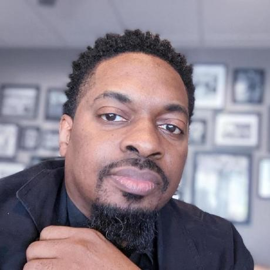

# GitHub Directory for Reading-Notes

# I am...Introduction

My name is Darshon Crudup (he/him) and I'm excited to be a part of the CodeFellows collective! I'm a Army Veteran as well as a graphic designer and filmmaker who also writes children's books (Baby Casey and the Golden Cookie) (Nufee's Adventure). I decided to enter the tech industry to transition into a new profession which will increase my earning potential. We've just begun our journey but I'm very anxious to learn more in order to hone my skills. Here is a link to my Github profile page for your review <https://github.com/darshon-crudup>.  Open to feed back.  Thanks.

## About

**This website indcludes links to the Markdown files I created for reading notes**

[Table of Contents](tableofcontents)
